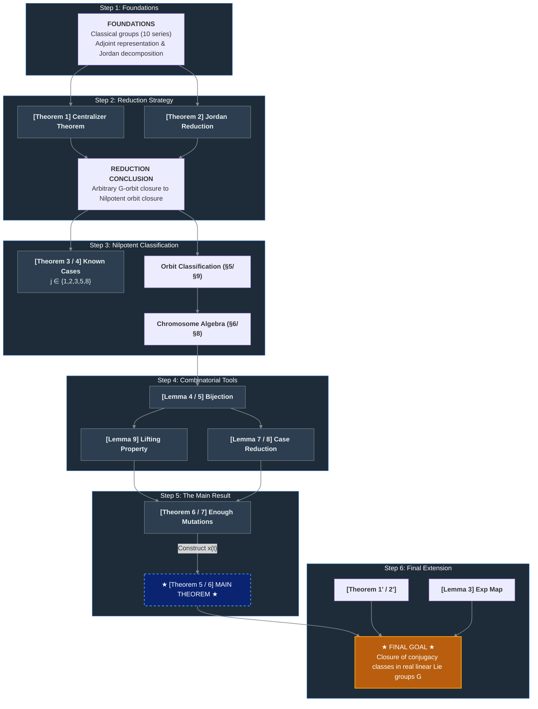

# YoungDiagram

> [!TIP]
> Documentation: https://samuele0271194.github.io/YoungDiagram/docs/

[](https://github.com/SamuelE0271194/YoungDiagram/actions/workflows/lean_action_ci.yml)

This Lean 4 project aims to formalize parts of Dragomir Djokovic's paper *Closures of Conjugacy Classes in Classical Real Linear Lie Groups. II* (1982).

## Current state

### Combinatorial layer (fully proved)

- `YoungDiagram/Gene.lean` defines genes and their signatures.
- `YoungDiagram/Chromosome.lean` defines chromosomes, rank, signature, and the prime operation.
- `YoungDiagram/Variety.lean` develops varieties and lift/filter constructions.
- `YoungDiagram/Mutations*.lean` formalizes several primitive mutation patterns.
- `YoungDiagram/Sigma*.lean` contains work toward the sigma conditions and orbit-order arguments.

### Nilpotent orbit bridge (statements + sorry'd proofs)

- `YoungDiagram/NilpotentOrbit.lean` — Defines `SeriesIndex` (j ∈ {4,6,7,9,10}), `NilpotentBlock`, `NilpotentType`, and the block-to-chromosome map `toChromosome` following Table IV (§5). States Lemma 4 (chromosome bijection, §7) as `toChromosome_injective` / `toChromosome_surjective`.
- `YoungDiagram/LieAlgebra/ClassicalSetup.lean` — Bundles the Lie algebra data (`ClassicalSetup`): base field F, vector space V, Lie subalgebra L ⊆ End_F(V), and form signature sig(f). Connects j = 6, 9 to mathlib's `skewAdjointLieSubalgebra`; j = 4 (hermitian) and j = 7, 10 (quaternionic) are deferred.
- `YoungDiagram/LieAlgebra/JordanBlock.lean` — Declares `jordanPartition` and `extractNilpotentType` (§5): given a nilpotent x ∈ L, extract its combinatorial type Δ(x). Sorry'd pending mathlib Jordan normal form theory.
- `YoungDiagram/LieAlgebra/OrbitClosure.lean` — States Theorem 5 (§7): orbit closure ↔ chromosome dominance (`orbit_closure_iff_dominance`). Defines the adjoint action, nilpotent orbits, and orbit closure relation.

## Building

```bash
lake build
```

For a few small experiments, see `YoungDiagram/Examples.lean`.

---

## Theorem & Lemma Reference Table
 
| Label | Section | Statement (summary) | Paper |
|---|---|---|---|
| **Theorem 1** | §4 (I) / §2 (II) | *Centralizer Theorem.* Let $G$ be a classical group and $x \in L$ semisimple. Then $C_G(x)$ is a finite direct product of classical groups: $C_G(x) = \prod_{\xi} C(\xi, x)$, where each factor belongs to the $k$-th series determined by $j$ and $\xi$ (see Table I/III). | Both |
| **Theorem 1′** | §13 (II) | Analogue of Theorem 1 for the conjugation action of $G$ on itself. If $x \in G$ is semisimple, then $C_G(x) = \prod_\lambda C(\lambda, x)$, each factor again a classical group. | II |
| **Theorem 2** | §5 (I) / §3 (II) | *Jordan Decomposition Reduction.* Let $x = x_s + x_n$ be the Jordan decomposition. Then $y \in \overline{G \cdot x}$ if and only if there exist $a \in G$ and $z \in \overline{C_G(x_s) \cdot x_n}$ such that $a \cdot y = x_s + z$. Reduces arbitrary orbit closures to nilpotent orbit closures. | Both |
| **Theorem 2′** | §6 (I) / §13 (II) | Conjugacy class analogue of Theorem 2. $y \in \overline{G \cdot x}$ (closure of conjugacy class) iff $\exists\, a \in G,\, z \in \overline{C_G(x_s) \cdot x_u}$ such that $a \cdot y = x_s z$. Reduces conjugacy class closures to unipotent classes. | Both |
| **Lemma 3** | §6 (I) | *Exponential Map Homeomorphism.* The exponential map $\exp: L \to G$ restricts to a $G$-equivariant homeomorphism from $\{\text{nilpotent elements}\}$ onto $\{\text{unipotent elements}\}$. Thus nilpotent orbits in $L$ biject with unipotent conjugacy classes in $G$, and their closure structures correspond. | I |
| **Theorem 3 / 4** | §7 (I) / §4 (II) | *Known cases $j \in \{1,2,3,5,8\}$.* For nilpotent $x, y \in L$: $G \cdot x \subseteq \overline{G \cdot y}$ iff $\text{rank}(x^k) \leq \text{rank}(y^k)$ for all $k \geq 0$. (Due to Gerstenhaber, Hesselink, Dixmier.) | Both |
| **Lemma 4 / 5** | §10 (I) / §7 (II) | *Chromosome Bijection.* The map $\theta \mapsto X(\theta)$ is a bijection from the set of nilpotent $G$-orbits in $L$ to the set of chromosomes $X \in \Phi_j$ satisfying $\text{sig}(X) = \text{sig}(f)$. Chromosomes serve as combinatorial labels for orbits. | Both |
| **Theorem 5 / 6** *(Main)* | §11 (I) / §7 (II) | **Main Theorem.** Let $\theta_1, \theta_2$ be nilpotent orbits of $G$ in $L$. Then $\theta_1 \subseteq \overline{\theta_2}$ if and only if $X(\theta_1) \leq X(\theta_2)$ (dominance order on chromosomes). | Both |
| **Theorem 6 / 7** *(Combinatorial)* | §12 (I) / §8 (II) | *Enough Mutations.* Let $\Phi$ be one of the five varieties, and $X, Y \in \Phi$ with $X < Y$ and $\text{sig}(X) = \text{sig}(Y)$. Then there exists a finite chain of $\Phi$-mutations $X = X_0 \to X_1 \to \cdots \to X_m = Y$. | Both |
| **Lemma 7** | §11 (II) | Every primitive $(\Pi,\Lambda)$- or $(\Lambda,\Pi)$-mutation has the form $\sigma(X) \to \sigma(Y)$ or $\tau(X) \to \tau(Y)$ for some primitive $\Pi$-mutation $X \to Y$. Reduces cases $j = 7, 10$ to $j = 4$. | II |
| **Lemma 8** | §11 (II) | Let $x \in M$ be nilpotent (a $j=4$ classical group). Viewed as an element of a $j=7$ (resp. $j=10$) group, its chromosome is $\sigma(X)$ (resp. $\tau(X)$), obtained by forgetting the polarization of odd (resp. even) genes of $X$. | II |
| **Lemma 9** *(Lifting)* | §14 (II) | *Lifting Property.* If $X \in \Phi$ and $X^k \to U$ is a $\Phi^k$-mutation, then there exists a $\Phi$-mutation $X \to Z$ such that $Z^k = U$ and $\text{sig}(X^i) = \text{sig}(Z^i)$ for $0 \leq i \leq k$. Core inductive tool for proving Theorem 6/7. | II |

## Proof Chain Diagram


